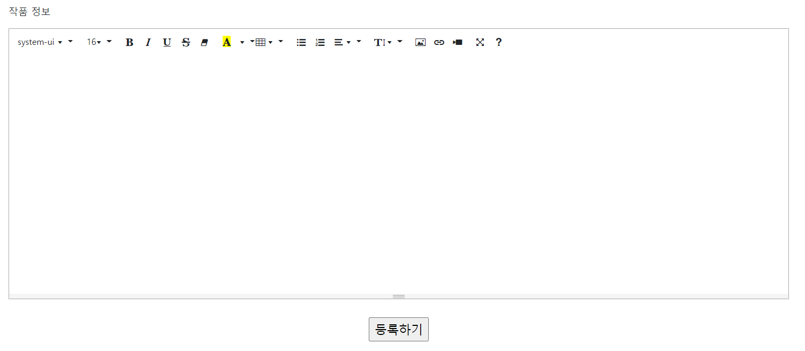
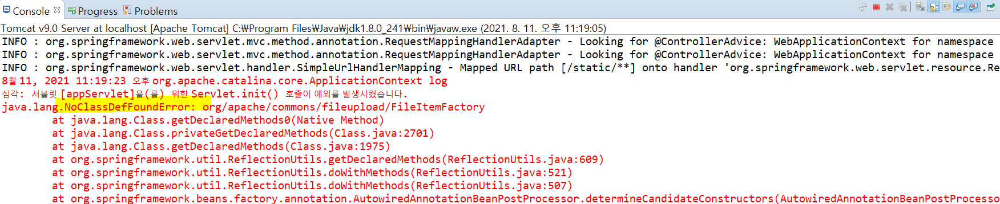
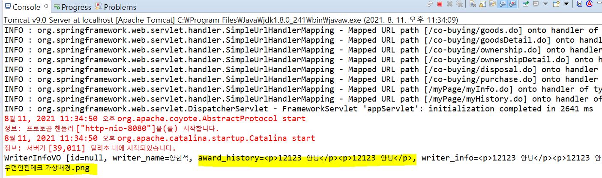

## 관리자 페이지의 작가 등록 page에서 summernote 적용하기

#### summernote란?

- html처럼 따로 css문법을 적용해서 디자인을 편집하는 것이 아니고 문서 편집 과정에서 화면에 포맷된 낱말, 문장이 출력물과 동일하게 나오는 방식이다.


#### summernote 적용

- **CDN 방식으로 연결**

```jsp
<link href="https://cdnjs.cloudflare.com/ajax/libs/summernote/0.8.2/summernote.css" rel="stylesheet">
	<script src="https://cdnjs.cloudflare.com/ajax/libs/summernote/0.8.2/summernote.js" defer></script>
```


- **summernote가 들어가길 원하는 위치에 html 추가**

```jsp
<textarea class="summernote" name="editordata"></textarea> 
```


- **자바스크립트 추가**

```jsp
<script type="text/javascript">
    $(document).ready(function() {
        //summernote
        $('.summernote').summernote({
            height : 400,
            lang : 'ko-KR',
            toolbar: [
                // [groupName, [list of button]]
                ['fontname', ['fontname']],
                ['fontsize', ['fontsize']],
                ['style', ['bold', 'italic', 'underline','strikethrough', 'clear']],
                ['color', ['forecolor','color']],
                ['table', ['table']],
                ['para', ['ul', 'ol', 'paragraph']],
                ['height', ['height']],
                ['insert',['picture','link','video']],
                ['view', ['fullscreen', 'help']]
            ],
            fontNames: ['Arial', 'Arial Black', 'Comic Sans MS', 'Courier New','맑은 고딕','궁서','굴림체','굴림','돋움체','바탕체'],
            fontSizes: ['8','9','10','11','12','14','16','18','20','22','24','28','30','36','50','72']
        });


    });	
</script>
```


- **기존의 jquery.js의 버전과 충돌이 있어서 jquery 버전 변경**

```jsp
<script type="text/javascript" src="https://cdnjs.cloudflare.com/ajax/libs/jquery/3.2.0/jquery.js"></script>
```


- **결과 화면**




## multipart 인코딩을 통하여 업로드한 데이터 받기

#### MultipartResolver 설정

- spring에서 제공하는 MultipartResolver는 **CommmnosMultipartResolver**이다. 
- MultipartResolver는 **Muiltpart객체를 컨트롤러에 전달하는 역할**을 한다.
- **spring-config.xml**
  - maxUploadSize 
    - type : long
    - 최대 업로드 가능한 바이트 크기, -1은 제한이 없음을 의미한다. 기본 값은 -1이다.
  - maxInMemorySize 
    - type : int
    - 디스크에 임시 파일을 생성하기 전에 메모리에 보관할 수 있는 최대 바이트 크기
    - 기본 값은 10240 바이트이다.

```xml
<!-- CommmnosMultipartResolver -->
<beans:bean id="multipartResolver" class="org.springframework.web.multipart.commons.CommonsMultipartResolver">
    <beans:property name="maxUploadSize" value="200000000" />
    <beans:property name="maxInMemorySize" value="200000000" />
</beans:bean>
```


- **jsp**

```jsp
<input type="file" name="attachfile">
```


#### 컨트롤러에서 데이터 받기 테스트(summernote, file)

- **controller**

```java
package kr.ac.artTechManager.writerInfo.controller;

import org.springframework.beans.factory.annotation.Autowired;
import org.springframework.stereotype.Controller;
import org.springframework.web.bind.annotation.ModelAttribute;
import org.springframework.web.bind.annotation.RequestMapping;
import org.springframework.web.multipart.MultipartFile;

import kr.ac.artTechManager.writerInfo.service.WriterInfoService;
import kr.ac.artTechManager.writerInfo.vo.WriterInfoVO;

@Controller
@RequestMapping("/manage")
public class WriterInfoController {
	@Autowired
	WriterInfoService service;
	
	@RequestMapping("/writerRegisterPro.do")
	public String addWriterInfo(@ModelAttribute("writerInfo") WriterInfoVO writerInfo, MultipartFile attachfile) {
		
		System.out.println(writerInfo);
		System.out.println(attachfile.getOriginalFilename());
		return "manage/writerList";
	}
}
```


#### NoClassDefFoundError 예외 발생

- NoClassDefFoundError가 발생하는 경우에는 pom.xml을 수정



- pom.xml

```xml
<!-- common fileupload -->
<dependency>
    <groupId>commons-fileupload</groupId>
    <artifactId>commons-fileupload</artifactId>
    <version>1.2.1</version>
</dependency>
 
 
<dependency>
    <groupId>commons-io</groupId>
    <artifactId>commons-io</artifactId>
    <version>1.4</version>
</dependency>

```


- **결과**




#### db insert, 파일 저장

- **controller** 

```java
@RequestMapping("/writerRegisterPro.do")								//IOException - 파일이 없을 때 발생할 에러			
public String addWriterInfo(WriterInfoVO writerInfo, MultipartFile attachfile) throws IOException{

    String file_path = "C:/art-tech/writerInfo_img";

    String orgn_file_name = attachfile.getOriginalFilename() ;
    //UUID클래스 - (특수문자를 포함한)문자를 랜덤으로 생성, "-"라면 생략으로 대체
    String file_chan_name = UUID.randomUUID().toString().replace("-", "") + orgn_file_name;
    long file_size = attachfile.getSize();

    writerInfo.setOrgn_file_name(orgn_file_name);
    writerInfo.setFile_chan_name(file_chan_name);
    writerInfo.setFile_size(file_size);
    writerInfo.setFile_path(file_path);

    //정보 insert
    int result = service.addWriterInfo(writerInfo);

    //파일 저장을 위한 File 객체 생성
    if(result == 1) {
        File file = new File(file_path + "/" + file_chan_name);
        attachfile.transferTo(file); //파일 저장
    }

    return "manage/writerList";
}
```


- **service**

```java
//작가 정보 추가
@Override
public int addWriterInfo(WriterInfoVO writerInfo) {
    return dao.insertWriterInfo(writerInfo);
}
```


- **dao**

```java
@Override
public int insertWriterInfo(WriterInfoVO writerInfo) {
    return sqlSession.insert("kr.ac.kopo.manage.writerInfo.insertWriterInfo", writerInfo);
}
```


- **쿼리**

```xml
<insert id="insertWriterInfo" parameterType="writerInfo">
    insert into sj_writer_info(id, writer_name, award_history, writer_info, career, file_chan_name,
    file_path, orgn_file_name, file_size) values('writer' || seq_sj_writer_info.nextval,
    #{writer_name}, #{award_history}, #{writer_info}, #{career}, #{file_chan_name},
    #{file_path}, #{orgn_file_name}, #{file_size})
</insert>
```

