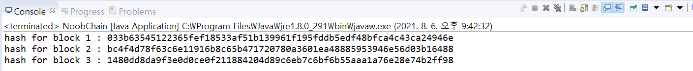
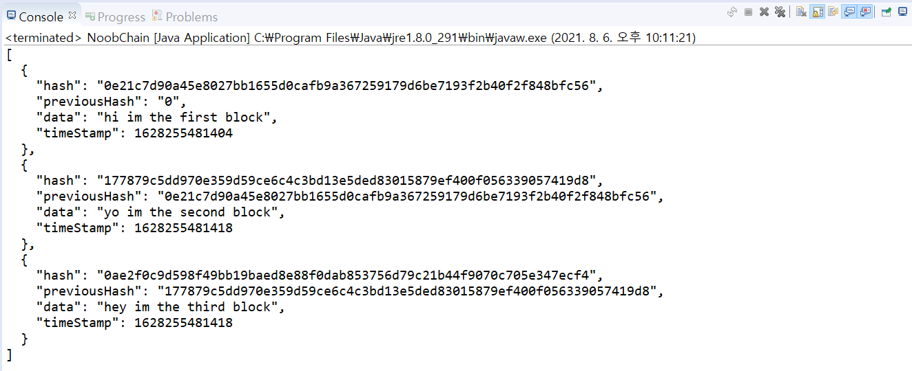
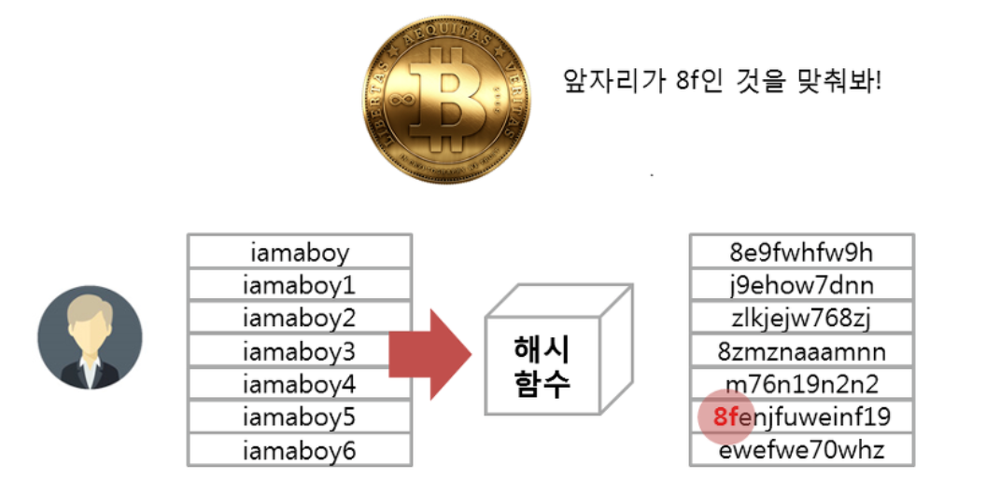
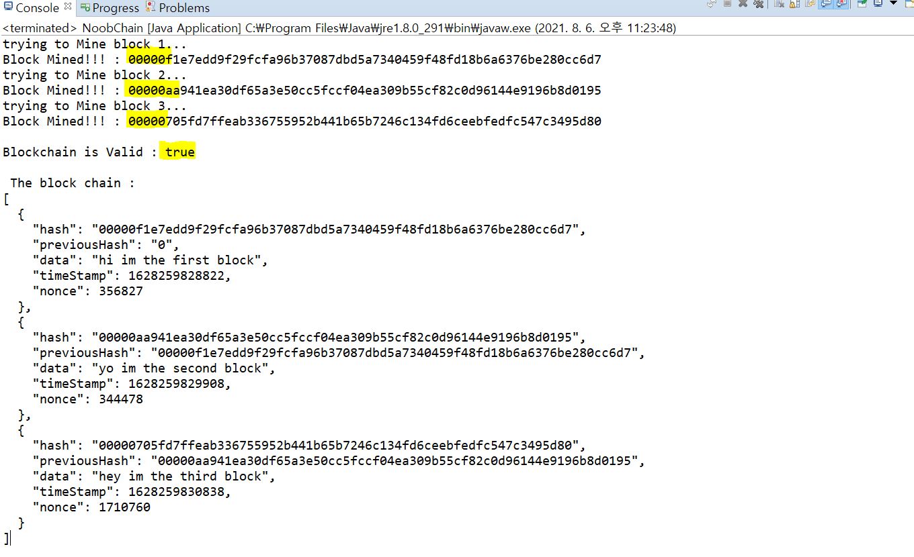
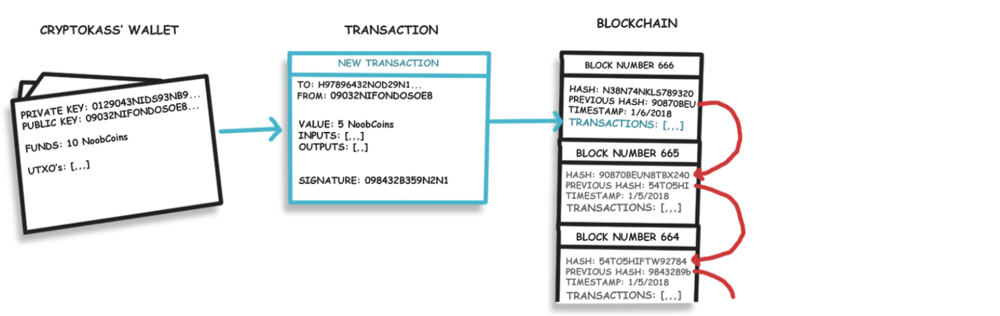
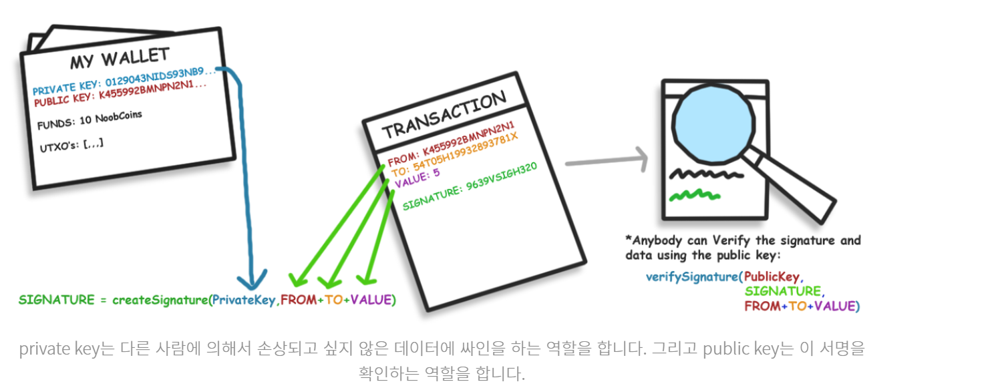
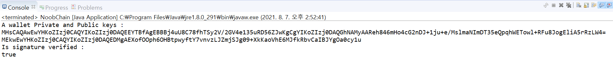

## 블록체인 구현하기 - 연습

- 블록체인의 각 블록은 자신의 디지털 서명(Digital Signature = Hash)을 가지고 있고, 이전 블록의 디지털 서명도 가지고 있으며 약간의 데이터를 가지고 있다. (이 데이터들은 교환이 가능)
- 자신만의 해쉬는 이전 해쉬를 통해서 계산이 된다. 


#### 블락체인을 구성하는 Block 클래스

- 기본 블록은 디지털 서명을 지니고 있는 String hash를 가지고 있다. 
- 디지털 서명은 SHA256(Secure Hash Algorithm) 알고리즘을 사용(왜???????????)
  - 256비트로 구성되며 64자리 문자열을 반환한다.
  - 블록체인에서 가장 많이 채택하여 사용하고 있다.
  - 암호화할 때 2의 256승만큼 경우의 수를 만들 수 있다. 그래서 무차별 대입을 수행해서 해시 충돌 사례를 찾아려고 할 때 많은 시간이 소요될 정도로 큰 숫자이다. 그래서 충돌로부터 비교적 안전하다고 평가되고 있다.
  - 일반적으로 입력값이 조금이라도 변동되면 출력값이 완전히 달라지기 때문에 출력값을 토대로 입력값을 유추하는 것은 불가능하다.  아주 작은 확률로 입력값이 다름에도 불구하고 출력값이 같은 경우가 발생하는데 이것을 충돌이라고 한다. 이러한 충돌의 발생 확률이 낮을수록 좋은 함수라고 평가된다.

- **Block.java**

```java
package kr.ac.kopo.blockChain;

import java.util.Date;

public class Block {
	public String hash; //디지털 서명
	public String previousHash; //이전 block의 hash값
	private String data; //block의 data
	private long timeStamp; //as number of milliseconds since 1/1/1970
	
	
	public Block(String data, String previousHash) {
		this.data = data;
		this.previousHash = previousHash;
		this.timeStamp = new Date().getTime();
	} 	
}
```


#### 디지털 서명 만들기

- SHA256 알고리즘 사용
- **StringUtil.java**

```java
package kr.ac.kopo.blockChain;

import java.security.MessageDigest;

public class StringUtil {
	
	//문자열에 SHA256을 적용하고 결과를 반환
	public static String applySha256(String input) {
		try {
			
			MessageDigest digest = MessageDigest.getInstance("SHA-256"); //SHA-256 형식으로 암호화
			//input에 적용
			byte[] hash = digest.digest(input.getBytes("UTF-8")); //digest는 함수를 통과하기 전의 원본 데이터를 메시지(message)라도 부르고, 통과된 이후의 데이터를 다이제스트(digest)라고 부른다.
			StringBuffer hexString = new StringBuffer(); //16진수로
			
			for(int i = 0; i < hash.length; ++i ) {
				String hex = Integer.toHexString(0xff & hash[i]);
				if(hex.length() == 1) hexString.append('0');
				hexString.append(hex);
			}
			
			return hexString.toString(); //발생한 시그니쳐를 하나의 문자열로 리턴
			
		} catch (Exception e) {
			throw new RuntimeException(e);
		}
	}
}
```


#### 해쉬값 계산

- Block 클래스의 메소드에 applySha256 헬퍼를 사용
- 영향을 받고 싶지 않은 블록의 모든 부분의 해쉬값들을 계산
- 그래서 previousHash, data, timeStamp 이 3개를 지니게 됨
- **Block.java**

```java
package kr.ac.kopo.blockChain;

import java.util.Date;

public class Block {
	public String hash; //디지털 서명
	public String previousHash; //이전 block의 hash값
	private String data; //block의 data
	private long timeStamp; //as number of milliseconds since 1/1/1970
	
	
	public Block(String data, String previousHash) {
		this.data = data;
		this.previousHash = previousHash;
		this.timeStamp = new Date().getTime();
		this.hash = calculateHash();
	} 
	
	public String calculateHash() {
		String calculatedhash = StringUtil.applySha256(previousHash + 
				Long.toString(timeStamp) + data);
		return calculatedhash;
	}
}

```


#### hash값 test

- 첫 번째 block은 Genesis Block이라고 불린다.
  - 어떤 블록체인 네트워크에서 생성된 첫 번째 블록을 말함
  - 이것은 첫 번째 블록이므로 해쉬값을 가지지 않기 때문에 previous hash값을 0으로 설정
- **NoobChain.java (main class)**

```java
package kr.ac.kopo.blockChain;

public class NoobChain {

	public static void main(String[] args) {
		Block genesisBlock = new Block("Hi im the first block", "0");
		System.out.println("hash for block 1 : " + genesisBlock.hash);
		
		Block secondBlock = new Block("Yo~ im the second block", genesisBlock.hash);
		System.out.println("hash for block 2 : " + secondBlock.hash);
		
		Block thirdBlock = new Block("Hey im the third block", secondBlock.hash);
		System.out.println("hash for block 3 : " + thirdBlock.hash);
		
	}

}
```




- 각각의 block은 각자의 전자 시그니쳐를 가지는데 그 block의 정보와 이전 block의 시그니처에 기반을 둔다.
- 이 block들을 ArrayList에 집어넣고 Json형태로 이것들을 확인하기 위해 json 라이브러리 추가
- **pom.xml**

```xml
<!-- https://mvnrepository.com/artifact/com.google.code.gson/gson -->
<dependency>
    <groupId>com.google.code.gson</groupId>
    <artifactId>gson</artifactId>
    <version>2.8.5</version>
</dependency>
```


#### block들을 ArrayList에 집어넣기

- **NoobChain.java (main class)**

```java
package kr.ac.kopo.blockChain;

import java.util.ArrayList;

import com.google.gson.GsonBuilder;

public class NoobChain {
	public static ArrayList<Block> blockchain = new ArrayList<>();
	public static void main(String[] args) {
		blockchain.add(new Block("hi im the first block", "0"));
		blockchain.add(new Block("yo im the second block", blockchain.get(blockchain.size()-1).hash));
		blockchain.add(new Block("hey im the third block", blockchain.get(blockchain.size()-1).hash));
		
		String blockchainJson = new GsonBuilder().setPrettyPrinting().create().toJson(blockchain);
		System.out.println(blockchainJson);
		
	}
}

```




#### 블록체인에 대한 무결성 검사

- NoobChain class에서 isChainValid() 생성
- 이 메소드는 체인 안에 속해있는 모든 블록들을 돌면서 해쉬값을 비교한다. 
  - hash 변수가 실제로 계산된 해쉬값과 같은지
  - 이전 block의 hash값이 이전의 해쉬 변수(previousHash)와 같은지 확인

- **NoobChain.java**

```java
package kr.ac.kopo.blockChain;

import java.util.ArrayList;

import com.google.gson.GsonBuilder;

public class NoobChain {
	public static ArrayList<Block> blockchain = new ArrayList<>();
	public static void main(String[] args) {
		blockchain.add(new Block("hi im the first block", "0"));
		blockchain.add(new Block("yo im the second block", blockchain.get(blockchain.size()-1).hash));
		blockchain.add(new Block("hey im the third block", blockchain.get(blockchain.size()-1).hash));
		
		String blockchainJson = new GsonBuilder().setPrettyPrinting().create().toJson(blockchain);
		System.out.println(blockchainJson);
		
	}
	
	public static Boolean isChainValid() {
		Block currentBlock;
		Block previousBlock;
		
		//blockchain을 반복문을 돌려서 hash 검사
		for(int i = 1; i < blockchain.size(); ++i) {
			currentBlock = blockchain.get(i);
			previousBlock = blockchain.get(i-1);
			
			//hash 변수가 실제로 계산된 hash값과 같은지 check
			if(!currentBlock.hash.equals(currentBlock.calculateHash())) {
				System.out.println("Current Hashes not equal");
				return false;
			}
			
			//previous hash와 previous block의 hash가 같은지 check
			if(! previousBlock.hash.equals(currentBlock.previousHash)) {
				System.out.println("Previous Hashes not equal");
				return false;
			}
		}
		return true;
	}
}
```


#### 마이닝

> https://needjarvis.tistory.com/240

- 어떤 문장이 와도 일정한 길이의 난수 값이 리턴되는 해시값이 채굴에서 중요한 기술이다.

- 채굴은 POW(Proof-of-work)라는 작업증명박식 채굴로 설명

- 채굴 로직

  - 채굴은 문제를 가장 빨리 맞춘 사람에게 보상(코인)을 받고, 블록의 생성 권한까지 받는다.
  - 사람들은 코인을 얻기 위해서 자신의 컴퓨터와 전기세를 기꺼이 헌납하고 채굴을 한다.
  - 노드를 유지하고 채굴을 하면서 사람들은 장부의 조작을 감시하고 문제를 푸는 작업을 수행하게 된다. 

  

  - 문제의 방식을 예로 쉽게 설명하면 위의 그림에서 앞자리가 8f인 해쉬값을 찾으라고 했다면 사용자는 문제를 맞추기 위해서 무작위로 문자열을 생성해서 해시함수(Hash Fnuction)에 보낸다. 이 방식을 무작위 공격이라고 한다.

- 이처럼 채굴할 사람들이 proof-of-work를 수행하도록 해야한다. 블록 안의 변수들 값의 해시값들이 특정 자릿수로 시작할 때까지 시도를 해야한다.
- nonce라고 불리는 int 타입의 변수를 calculateHash() 메소드 안에 집어 넣는다. 또한 필요성이 많은 mineBlock()도 안에 넣는다.
- **Block.java**
  
  - mineBlock(int difficulty)의 difficulty는 멤버가 풀여야할 자릿수

```java
package kr.ac.kopo.blockChain;

import java.util.Date;

public class Block {
	public String hash; //디지털 서명
	public String previousHash; //이전 block의 hash값
	private String data; //block의 data
	private long timeStamp; //as number of milliseconds since 1/1/1970
	private int nonce;
	
	public Block(String data, String previousHash) {
		this.data = data;
		this.previousHash = previousHash;
		this.timeStamp = new Date().getTime();
		this.hash = calculateHash();
	} 
	
	public String calculateHash() {
		String calculatedhash = StringUtil.applySha256(
				previousHash + 
				Long.toString(timeStamp) +
				Integer.toString(nonce) + 
				data);
		return calculatedhash;
	}
	
	//difficulty는 멤버가 풀여야할 자릿수
	public void mineBlock(int difficulty) {
		String target = new String(new char[difficulty]).replace('\0', '0');
		while(!hash.substring(0, difficulty).equals(target)) {
			nonce ++ ;
			hash = calculateHash();
		}
		System.out.println("Block Mined!!! : " + hash);
	}
}

```

- NoobChain class에 static 변수로 difficulty를 추가하고 mineBlock을 작동
- isChainValid()를 불러 각 블록이 마이닝에 의해서 해결된 해쉬값을 지니는지 체크
- NoobChain .java

```java
package kr.ac.kopo.blockChain;

import java.util.ArrayList;

import com.google.gson.GsonBuilder;

public class NoobChain {
	public static ArrayList<Block> blockchain = new ArrayList<>();
	public static int difficulty = 5;
	
	public static void main(String[] args) {
		blockchain.add(new Block("hi im the first block", "0"));
		System.out.println("trying to Mine block 1...");
		blockchain.get(0).mineBlock(difficulty);
		
		blockchain.add(new Block("yo im the second block", blockchain.get(blockchain.size()-1).hash));
		System.out.println("trying to Mine block 2...");
		blockchain.get(1).mineBlock(difficulty);
		
		blockchain.add(new Block("hey im the third block", blockchain.get(blockchain.size()-1).hash));
		System.out.println("trying to Mine block 3...");
		blockchain.get(2).mineBlock(difficulty);
		
		System.out.println("\nBlockchain is Valid : " + isChainValid());
		
		String blockchainJson = new GsonBuilder().setPrettyPrinting().create().toJson(blockchain);
		System.out.println("\n The block chain : ");
		System.out.println(blockchainJson);
		
	}
	
	public static Boolean isChainValid() {
		Block currentBlock;
		Block previousBlock;
		
		//blockchain을 반복문을 돌려서 hash 검사
		for(int i = 1; i < blockchain.size(); ++i) {
			currentBlock = blockchain.get(i);
			previousBlock = blockchain.get(i-1);
			
			//hash 변수가 실제로 계산된 hash값과 같은지 check
			if(!currentBlock.hash.equals(currentBlock.calculateHash())) {
				System.out.println("Current Hashes not equal");
				return false;
			}
			
			//previous hash와 previous block의 hash가 같은지 check
			if(! previousBlock.hash.equals(currentBlock.previousHash)) {
				System.out.println("Previous Hashes not equal");
				return false;
			}
		}
		return true;
	}
}

```


- **누군가가 블록체인 시스템의 데이터에 영향을 미치고 싶을 경우**
  - 그의 블록체인이 invalid 상태
  - 더 긴 블록체인을 만들 수 없어야 한다.
  - 당신의 네트워크에 의해서 얻어진 블록체인은 가장 긴 체인에 비해서 시간적 우위를 지닌다.


- **지금까지의 기본 블록체인의 특징**

  - 데이터를 저장하는 블록들로 구성되어 있다.
  - 이 블록들은 디지털 서명을 지니고 있고 체인처럼 서로를 연결시켜준다.
  - 새로운 블록들을 생성하기 위해서 proof of work 마이닝 진행
  - 블록 안의 데이터의 변화 혹은 유효성에 대한 체크가 가능하다.

  


- **위의 data는 의미없는 데이터를 지니고 있어서 거래내역을 지니고 있는 데이터로 바꾸기**


#### 월렛 준비하기

- 월렛은 블록체인에서 사용되는 암호화폐를 보관하기 위해 사용한다.

- 암호 화폐 상에서 코인의 소유권은 블록체인 상에서의 트랜잭션으로 이루어져 있다.
- 모든 참여자들은 펀드를 받고 보낼 수 있는 하나의 주소를 가지고 있는데 월렛의 기본 형태로 월렛은 이러한 주소들을 담을 수 있다.
- 이 대부분의 월렛들은 블록체인 하에서 새로운 트랜잭션을 생성할 수 있는 소프트웨어이기도 하다.



- **Wallet 클래스 생성**
  - public key와 private key 생성 이유
    - public key는 우리의 주소 역할을 한다. 이 public key를 대금을 받는 용도로 공유하는 것도 가능하다.
    - private key는 트랜잭션에 싸인을 하는 기능을 수행한다. private key의 주인 외에는 아무도 noobcoin을 사용할 수 없도록 하는 것이다. 그렇게 때문에 사용자는 private key를 비밀스럽게 유지해야 한다.
    - public key를 트랜잭션을 따라서 보내고, 이 public key는 시그니쳐가 유효한지 아닌지 여부를 확인하고 데이터를 다른 사람이 건드렸는지를 확인한다.

```java
package kr.ac.kopo.blockChain;

import java.security.*;

public class Wallet {
	public PrivateKey privateKey;
	public PublicKey publicKey;
}

```



- private key와 public key를 "KeyPair"안에서 생성시킬 것이다. KeyPair들을 생성하기 위해서 Elliptic-curve-cryptography를 사용할 것이다. Wallket class에 generateKeyPair() 메소드를 추가하고 생성자에서 부르도록 수정
- Wallet.java

```java
package kr.ac.kopo.blockChain;

import java.security.*;
import java.security.spec.ECGenParameterSpec;

public class Wallet {
	public PrivateKey privateKey;
	public PublicKey publicKey;
	
	public Wallet() {
		generateKeyPair();
	}
	
	public void generateKeyPair() {
		try {
			KeyPairGenerator keyGen = KeyPairGenerator.getInstance("ECDSA","BC");
            //타원곡선 DSA(Elliptic Curve Digital Signature Algorithm, ECDSA)
            //타원곡선을 이용한 전자서명 알고리즘
            
			SecureRandom random = SecureRandom.getInstance("SHA1PRNG");
			//예측할 수 없는 seed를 이용하여 강력한 난수를 생성
            
            ECGenParameterSpec ecSpec = new ECGenParameterSpec("prime192v1");
			
			//key generator를 초기화하고 키 쌍을 생성
			keyGen.initialize(ecSpec,random); //256
			KeyPair keyPair = keyGen.generateKeyPair();
			
			//set the public and private keys from the keyPair
			privateKey = keyPair.getPrivate();
			publicKey = keyPair.getPublic();
			
		} catch (Exception e) {
			throw new RuntimeException(e);
		}
	}

}
```


#### Transactions & Signatures(트랜잭션&시그니처)

- 트랜잭션이 가지고 있는 데이터
  - 계좌를 보내는 사람의 public key(address)
  - 계좌를 받는 사람의 public key(address)
  - 이체되는 계좌의 수량 혹은 금액
  - 보내는 사람이 실제로 계좌를 가지고 있는지를 증명할 이전 트랜잭션들의 레퍼런스 인풋
  - 트랜잭션에서 그에 해당하는 주소가 받은 금액을 보여주는 아웃풋(추후 프랜잭션에서 인풋값이 되는 값)
  - 암호화된 시그니쳐, 이 암호화된 서명을 통해서 주소의 실제 주인이 트랜잭션을 통해 돈을 보내는지 확인할 수 있다. 또한 데이터에 어떤 변화가 생겼는지 알 수 있다.(예를들어 제 3자가 보내는 금액을 바꾸는 것을 방지)
- 새로운 트랜잭션 클래스 생성


- **Transaction.java**
  - 일단 트랜잭션에 사용되는 데이터 정의
  - TransactionInput, TransactionOutput은 나중에 생성

```java
package kr.ac.kopo.blockChain;

import java.security.*;
import java.util.ArrayList;

public class Transaction {
	public String transactionId; //this is also hash of the transaction
	public PublicKey sender; //senders address(public key)
	public PublicKey reciepient; //recipients address(public key)
	public float value;
	public byte[] signature ; //This is to prevent anybody else from spending funds in our wallet.
	
	public ArrayList<TransactionInput> inputs = new ArrayList<>();
	public ArrayList<TransactionOutput> outputs = new ArrayList<>();
	
	private static int sequence = 0; //a rough count of how many transactions have bean generated 
	
}
```


#### Signatures(시그니처)

- **시그니처의 목적과 작동 원리**
  - 실제 코인의 오너만이 그 코인을 사용할 수 있도록 허락해주는 역할
  - 새로운 블럭이 생성되지 전(시작 시점에서) 이미 접수된 트랜잭션에 대해서 다른 사람들이 수정하지 못하도록 방지
  - the private key는 데이터를 서명하는데 사용되고, the public key는 그것의 진위를 확인하는데 사용
- **시그니처를 생성하는 메소드 작성을 위해서 StringUtil.java 수정**

```java
package kr.ac.kopo.blockChain;

import java.security.Key;
import java.security.MessageDigest;
import java.security.PrivateKey;
import java.security.PublicKey;
import java.security.Signature;
import java.util.Base64;

public class StringUtil {
	
	//문자열에 SHA256을 적용하고 결과를 반환
	public static String applySha256(String input) {
		try {
			
			MessageDigest digest = MessageDigest.getInstance("SHA-256");
			
			byte[] hash = digest.digest(input.getBytes("UTF-8"));
			StringBuffer hexString = new StringBuffer(); //16진수로
			
			for(int i = 0; i < hash.length; ++i ) {
				String hex = Integer.toHexString(0xff & hash[i]);
				if(hex.length() == 1) hexString.append('0');
				hexString.append(hex);
			}
			
			return hexString.toString(); //발생한 시그니쳐를 하나의 문자열로 리턴
			
		} catch (Exception e) {
			throw new RuntimeException(e);
		}
	}
	
	//Applies ECDSA Signature and returns the result (As bytes)
	//private key, input을 받고 서명을 한 뒤 바이트 배열 리턴
	public static byte[] applyECDSASig(PrivateKey privateKey, String input) {
		Signature dsa;
		byte[] output = new byte[0];
		
		try {
			dsa = Signature.getInstance("ECDSA", "BC");
			dsa.initSign(privateKey);
			byte[] strByte = input.getBytes();
			dsa.update(strByte);
			byte[] realSig = dsa.sign();
			output = realSig;
			
		} catch (Exception e) {
			throw new RuntimeException(e);
		}
		
		return output;
	}
	
	//Verifies a String signature
	//시그니처가 유효한지
	public static boolean verifyECDSASig(PublicKey publicKey, String data, byte[] signature) {
		try {
			Signature ecdsaVerify = Signature.getInstance("ECDSA", "BC");
			ecdsaVerify.initVerify(publicKey);
			ecdsaVerify.update(data.getBytes());
			return ecdsaVerify.verify(signature);
		} catch (Exception e) {
			throw new RuntimeException(e);
		}
	}
	
	public static String getStringFromKey(Key key) {
		return Base64.getEncoder().encodeToString(key.getEncoded());
	}
	
}

```


- 이 시그니쳐 메소드들을 transaction 클래스에서 활용하기 위해서 Transaction class에 메소드 추가
- **Transaction.java** 
  - 실제로 현실에서 사용하고자 한다면 사용되는 인풋/아웃풋 데이터라든지 타임 스탬프 값과 같은 정보의 서명도 추가도 가능할 것이다.(현재는 최소한의 것만 서명)

```java
package kr.ac.kopo.blockChain;

import java.security.*;
import java.util.ArrayList;

public class Transaction {
	public String transactionId; //this is also hash of the transaction
	public PublicKey sender; //senders address(public key)
	public PublicKey reciepient; //recipients address(public key)
	public float value;
	public byte[] signature ; //This is to prevent anybody else from spending funds in our wallet.
	
	public ArrayList<TransactionInput> inputs = new ArrayList<>();
	public ArrayList<TransactionOutput> outputs = new ArrayList<>();
	
	private static int sequence = 0; //a rough count of how many transactions have bean generated 

	public Transaction(PublicKey from, PublicKey to, float value, ArrayList<TransactionInput> inputs) {
		this.sender = from;
		this.reciepient = to;
		this.value = value;
		this.inputs = inputs;
	}
	
	
	//Signs all the data we dont wish to be tampered with
	//조작되지 않길 바라는 모든 데이터에 서명한다.
	public void generateSignature(PrivateKey privateKey) {
		String data = StringUtil.getStringFromKey(sender) 
					+ StringUtil.getStringFromKey(reciepient)
					+ Float.toString(value);
		signature = StringUtil.applyECDSASig(privateKey, data);
	}
	
	//Verifies the data we signed hasnt been tampered with
	//서명한 데이터가 변조되지 않았는지 확인
	public boolean verifySignature() {
		String data = StringUtil.getStringFromKey(sender) + StringUtil.getStringFromKey(reciepient)
						+ Float.toString(value);
		return StringUtil.verifyECDSASig(sender, data, signature);
	}
	
	
	
}

```

- 이 서명들은 miner(블록체인 주인)에 의해서 새로운 트랜잭션이 블록에 추가될 때마다 확인될 것이다.


#### 월렛과 시그니쳐 테스트

- 라이브러리 추가

```xml
<dependency>
    <groupId>org.bouncycastle</groupId>
    <artifactId>bcpkix-jdk15on</artifactId>
    <version>1.50</version>
</dependency>
```


- **NoobCoin class 수정**

```java
package kr.ac.kopo.blockChain;

import java.security.Security;
import java.util.ArrayList;

import com.google.gson.GsonBuilder;

public class NoobChain {
	public static ArrayList<Block> blockchain = new ArrayList<>();
	public static int difficulty = 5;
	public static Wallet walletA;
	public static Wallet walletB;
	
	
	public static void main(String[] args) {
		
		//setup Bouncy castle as a Security Provider
		Security.addProvider(new org.bouncycastle.jce.provider.BouncyCastleProvider());
		
		//create the new wallets
		walletA = new Wallet();
		walletB = new Wallet();
		
		//test public and private keys
		System.out.println("A wallet Private and Public keys : ");
		System.out.println(StringUtil.getStringFromKey(walletA.privateKey));
		System.out.println(StringUtil.getStringFromKey(walletA.publicKey));
		
		
		//create a test transaction from walletA to wallet B
		//받는 사람이 B, 보내는 사람 A
		Transaction transaction = new Transaction(walletA.publicKey, walletB.publicKey, 5, null);
		//walletA의 private key를 사용해서 트랜잭션에 서명
		transaction.generateSignature(walletA.privateKey);
		
		//Verify the signature works and verify it from the public key
		//시그니처가 작동하는지 확인하고 공개키에서 확인
		System.out.println("Is signature verified : ");
		//서명한 데이터가 변조되지 않았는지 확인
		System.out.println(transaction.verifySignature());
		
	}
	
	public static Boolean isChainValid() {
		Block currentBlock;
		Block previousBlock;
		
		//blockchain을 반복문을 돌려서 hash 검사
		for(int i = 1; i < blockchain.size(); ++i) {
			currentBlock = blockchain.get(i);
			previousBlock = blockchain.get(i-1);
			
			//hash 변수가 실제로 계산된 hash값과 같은지 check
			if(!currentBlock.hash.equals(currentBlock.calculateHash())) {
				System.out.println("Current Hashes not equal");
				return false;
			}
			
			//previous hash와 previous block의 hash가 같은지 check
			if(! previousBlock.hash.equals(currentBlock.previousHash)) {
				System.out.println("Previous Hashes not equal");
				return false;
			}
		}
		return true;
	}
}
```




- 이제 output과 input을 생성하고 확인하며 트랜잭션을 블록체인 안에 저장해야 한다.
- 어떻게 암호화폐의 소유권이 결정되는가??
  - 당신이 1 비트코인을 소유하기 위해서 1 비트코인을 받아야 한다. 장부를 통해 1 비트코인을 당신 이름으로 추가하고, 보낸 이로부터 1 비트코인을 빼는 것이 아니라 보내는 사람이 1 비트코인을 이전에 받았다는 것을 기록한 후에, 트랜잭션 아웃풋이 1 비트코인이 당신의 주소로 보내졌다는 사실을 보여주도록 만드는 것이다. 
  - **즉, 트랜잭션의 input들은 이전 트랜잭션 output들에 대한 기록들이다.**
  - 당신의 wallet의 잔액은 당신의 주소에 해당하는 사용되지 않은 모든 트랜잭션 output들이다.
  - 지금부터 비트코인의 행적은 추적하고, **사용되지 않은 트랜잭션 output들을 `UTXO's`라고 하자**


#### TransactionInput class 생성

- TransactionInput.java
  - 이 클래스는 TransactionOutput들 중에서 아직 사용되지 않은 것들을 기록하는 class이다.
  - **TransactionOutputId는 그에 대응하는 TransactionOutput을 찾는데 이용될 것이며, miner가 소유권을 체크하는데 이용될 것이다.**

```java
package kr.ac.kopo.blockChain;

public class TransactionInput {
	public String transactionOutputId ; //reference to transactionOutput -> transactionId
	public TransactionOutput UTXO; //contains the unspent transaction output
	
	public TransactionInput(String transactionOutputId) {
		this.transactionOutputId = transactionOutputId;
	}

}

```


#### TransactionOutput class 생성

- TransactionOutput.java
  - Transaction 아웃풋들은 트랜잭션으로부터 각 구성원들에게 보내진 최종 금액을 보여준다. 이 정보들은 새로운 트랜잭션에서는 인풋으로써 기록되게 될 것이고, 당신이 보낼 보인이 남아있다는 것을 확인하는 용도로 쓰인다.

```java
package kr.ac.kopo.blockChain;

import java.security.PublicKey;

public class TransactionOutput {
	public String id;
	public PublicKey reciepient ; //also known as the new owner of these coins.
								 //코인의 새로운 주인
	public float value; //the amount of coins they own
	public String parentTransactionId; //the id of the transaction this output was created in
									   //이 output이 생성된 트랜잭션 id
	
	
	public TransactionOutput(PublicKey reciepient, float value, String parentTransactionId) {
		this.reciepient = reciepient;
		this.value = value;
		this.parentTransactionId = parentTransactionId;
		this.id = StringUtil.applySha256(StringUtil.getStringFromKey(reciepient) + Float.toString(value) + parentTransactionId);
	}
	
	//check if coin belongs to you
	public boolean isMine(PublicKey publicKey) {
		return (publicKey == reciepient);
	}
}

```


- 체인의 블록들은 많은 트랜잭션들을 취급한다. 그래서 그 블록체인들은 아주 길 것이기 때문에, 새로운 트랜잭션을 처리하는데 굉장히 긴 시간이 걸린다. 왜냐하면 input들을 찾고 확인해야 하기 때문이다.
- 이를 피하기 위해서 사용되지 않은 모든 트랜잭션의 추가 컬렉션을 두어 인풋으로 사용되게 할 것이다.
- NoobChain class는 모든 UTXO에 대한 컬렉션을 추가한다.


#### NoobChain class 추가

- NoobChain class는 모든 UTXO에 대한 컬렉션을 추가한다.

```java
package kr.ac.kopo.blockChain;

import java.security.Security;
import java.util.ArrayList;
import java.util.HashMap;

import com.google.gson.GsonBuilder;

public class NoobChain {
	public static ArrayList<Block> blockchain = new ArrayList<>();
	public static HashMap<String, TransactionOutput> UTXOs = new HashMap<>(); //list of all unspent transactions.
	public static int difficulty = 5;
	public static Wallet walletA;
	public static Wallet walletB;
```


- 이제는 Transaction class 안에 들어있는 processTransaction 메소드를 boolean 타입으로 만들어 이 트랜잭션을 처리함으로 모든 것을 합쳐볼 것이다.

#### Transaction.java 수정

```java
package kr.ac.kopo.blockChain;

import java.security.*;
import java.util.ArrayList;

public class Transaction {
	public String transactionId; //this is also hash of the transaction
	public PublicKey sender; //senders address(public key)
	public PublicKey reciepient; //recipients address(public key)
	public float value;
	public byte[] signature ; //This is to prevent anybody else from spending funds in our wallet.
	
	public ArrayList<TransactionInput> inputs = new ArrayList<>();
	public ArrayList<TransactionOutput> outputs = new ArrayList<>();
	
	private static int sequence = 0; //a rough count of how many transactions have bean generated 

	public Transaction(PublicKey from, PublicKey to, float value, ArrayList<TransactionInput> inputs) {
		this.sender = from;
		this.reciepient = to;
		this.value = value;
		this.inputs = inputs;
	}
	
	//generateSignature, verifySignature는  miner(블록체인 주인)에 의해서 새로운 트랜잭션이 블록에 추가될 때마다 서명이 확인될 것이다.
	
	public boolean processTransaction() {
		
		if(verifySignature() == false) {
			System.out.println("#Transaction Signature failed to verify");
			return false;
		}
		
		//Gathers transaction inputs (Making sure they are unspent) 
		for(TransactionInput i : inputs) {
			i.UTXO = NoobChain.UTXOs.get(i.transactionOutputId);
		}
		
		//checks if transaction is valid
		if(getInputsValue() < NoobChain.minimumTransaction) {
			System.out.println("Transaction Inputs too small : " + getInputsValue());
			return false;
		}
		
		//Generate transaction outputs (output 발생)
		float leftOver = getInputsValue() - value; //get value of inputs then the left over change
												   //input 값 얻기 남은 변경 값
		transactionId = calculateHash();
		outputs.add(new TransactionOutput(this.reciepient, value, transactionId)); //send value to recipient
		outputs.add(new TransactionOutput(this.sender, leftOver, transactionId)); //send the left over 'change' back to sender
		
		//Add outputs to Unspent list
		for(TransactionOutput o : outputs) {
			NoobChain.UTXOs.put(o.id, o);
		}
		
		//Remove transaction inputs from UTXO lists as spent
		for(TransactionInput i : inputs) {
			if(i.UTXO == null) continue; //if Transaction can't be found skip it(트랜잭션을 찾을 수 없으면 건너뛴다)
			NoobChain.UTXOs.remove(i.UTXO.id);
		}
	
		return true;
	
	}
	
	//returns sum of inputs(UTXOs) values
	public float getInputsValue() {
		float total = 0;
		for(TransactionInput i : inputs) {
			if(i.UTXO == null) continue ; //if Transaction can't be found skip it, This behavior may not be optimal.
			total += i.UTXO.value ; 
		}
		return total;
	}
	
	
	//Signs all the data we dont wish to be tampered with
	//조작되지 않길 바라는 모든 데이터에 서명한다.
	public void generateSignature(PrivateKey privateKey) {
		String data = StringUtil.getStringFromKey(sender) 
					+ StringUtil.getStringFromKey(reciepient)
					+ Float.toString(value);
		signature = StringUtil.applyECDSASig(privateKey, data); 
		//나중에 public key를 사용해서 이 시그니처를 해독함 그럼 시그니처에 정보들이 들어있는거지?  
	}
	
	//Verifies the data we signed hasnt been tampered with
	//서명한 데이터가 변조되지 않았는지 확인
	public boolean verifySignature() {
		String data = StringUtil.getStringFromKey(sender) + StringUtil.getStringFromKey(reciepient)
						+ Float.toString(value);
		return StringUtil.verifyECDSASig(sender, data, signature);
	}
	
	//returns sum or outputs
	public float getOutputsValue() {
		float total = 0;
		for(TransactionOutput o : outputs) {
			total += o.value;
		}
		return total;
	}
	
	
	//this calculates the transaction hash(which will be used as its id)
	private String calculateHash() {
		sequence ++ ; //increase the sequence to avoid 2 identical transactions having the same hash
		
		return StringUtil.applySha256(
				StringUtil.getStringFromKey(sender) + 
				StringUtil.getStringFromKey(reciepient) +
				Float.toString(value) + sequence
				);
	}
	
}
```


#### 블록에 트랜잭션 넣기

- 이제 작동하는 트랜잭션 시스템을 만들었으니, 이 시스템을 블록체인에 적용해보자
- 우선 블록체인 안에 들어있는 쓸모없는 데이터들을 트랜잭션의 ArrayList로 교체해야 한다.
- 하지만 하나의 블록에는 수천개의 트랜잭션이 있을 수 있으니, 해쉬 계산을 하기에는 너무나 많아서 트랜잭션들의 merkle 트리를 사용해서 이를 해결한다.


- StringUtil.java에 merkleroot 발생하는 메소드 생성

```java
package kr.ac.kopo.blockChain;

import java.security.Key;
import java.security.MessageDigest;
import java.security.PrivateKey;
import java.security.PublicKey;
import java.security.Signature;
import java.util.ArrayList;
import java.util.Base64;
import java.util.List;

import com.google.gson.GsonBuilder;

public class StringUtil {
	
	//문자열에 SHA256을 적용하고 결과를 반환
	public static String applySha256(String input) {
		try {
			
			MessageDigest digest = MessageDigest.getInstance("SHA-256");
			
			byte[] hash = digest.digest(input.getBytes("UTF-8"));
			StringBuffer hexString = new StringBuffer(); //16진수로
			
			for(int i = 0; i < hash.length; ++i ) {
				String hex = Integer.toHexString(0xff & hash[i]);
				if(hex.length() == 1) hexString.append('0');
				hexString.append(hex);
			}
			
			return hexString.toString(); //발생한 시그니쳐를 하나의 문자열로 리턴
			
		} catch (Exception e) {
			throw new RuntimeException(e);
		}
	}
	
	//Applies ECDSA Signature and returns the result (As bytes)
	//private key, input을 받고 서명을 한 뒤 바이트 배열 리턴
	public static byte[] applyECDSASig(PrivateKey privateKey, String input) {
		Signature dsa;
		byte[] output = new byte[0];
		
		try {
			dsa = Signature.getInstance("ECDSA", "BC");
			dsa.initSign(privateKey);
			byte[] strByte = input.getBytes();
			dsa.update(strByte);
			byte[] realSig = dsa.sign();
			output = realSig;
			
		} catch (Exception e) {
			throw new RuntimeException(e);
		}
		
		return output;
	}
	
	//Verifies a String signature
	//시그니처가 유효한지
	public static boolean verifyECDSASig(PublicKey publicKey, String data, byte[] signature) {
		try {
			Signature ecdsaVerify = Signature.getInstance("ECDSA", "BC");
			ecdsaVerify.initVerify(publicKey);
			ecdsaVerify.update(data.getBytes());
			return ecdsaVerify.verify(signature);
		} catch (Exception e) {
			throw new RuntimeException(e);
		}
	}
	
	//Short hand helper to turn Object into a json string
	public static String getJson(Object o) {
		return new GsonBuilder().setPrettyPrinting().create().toJson(o);
	}
	
	//Returns difficulty string target, to compare to hash. eg difficulty of 5 will return "00000" 
	public static String getDificultyString(int difficulty) {
		return new String(new char[difficulty]).replace('\0', '0');
	}
	
	
	//암호화된 string를 어떤 키로부터 리턴
	public static String getStringFromKey(Key key) {
		return Base64.getEncoder().encodeToString(key.getEncoded());
	}
	
	public static String getMerleRoot(ArrayList<Transaction> transactions) {
		int count = transactions.size();
		
		List<String> previousTreeLayer = new ArrayList<>();
		for(Transaction transaction : transactions) {
			previousTreeLayer.add(transaction.transactionId);
		}
		List<String> treeLayer = previousTreeLayer;
		
		while(count > 1) {
			treeLayer = new ArrayList<>();
			for(int i=1; i< previousTreeLayer.size(); i+=2) {
				treeLayer.add(applySha256(previousTreeLayer.get(i-1) + previousTreeLayer.get(i) ));
			}
			count = treeLayer.size();
			previousTreeLayer = treeLayer;
		}
		String merkleRoot = (treeLayer.size() == 1) ? treeLayer.get(0) : "";
		return merkleRoot;
		
	}
	
}
```


#### Block class 수정

- block의 생성자가 업데이트 되었다. 이는 스트링 형태의 데이터로 더이상 보내야할 필요가 없기 때문이다. 
- 또한 merkle root를 계산된 calculate hash 메소드에 포함시켰다.
- addTransaction 메소드는 트랜잭션들을 추가할 것이고 만약 트랜잭션이 성공적으로 추가되었다면 true를 반환한다.

```java
package kr.ac.kopo.blockChain;

import java.util.ArrayList;
import java.util.Date;

public class Block {
	public String hash; //디지털 서명
	public String previousHash; //이전 block의 hash값
	public String merkleRoot;
	public ArrayList<Transaction> transactions = new ArrayList<>();//our data will be a simple message
	private long timeStamp; //as number of milliseconds since 1/1/1970
	private int nonce;
	
	public Block(String previousHash) {
		this.previousHash = previousHash;
		this.timeStamp = new Date().getTime();
		this.hash = calculateHash(); //Making sure we do this after we set the other values
	} 
	
	//Calculate new hash based on blocks contents
	public String calculateHash() {
		String calculatedhash = StringUtil.applySha256(
				previousHash + 
				Long.toString(timeStamp) +
				Integer.toString(nonce) + 
				merkleRoot
				);
		return calculatedhash;
	}
	
	
	//difficulty는 멤버가 풀여야할 자릿수
	//Increases nonce value until hash target is reached
	public void mineBlock(int difficulty) {
		merkleRoot = StringUtil.getMerleRoot(transactions);
		String target = StringUtil.getDificultyString(difficulty); //Create a String with difficulty * "0"
		while(!hash.substring(0, difficulty).equals(target)) {
			nonce ++ ;
			hash = calculateHash();
		}
		System.out.println("Block Mined!!! : " + hash);
	}
	
	//Add transactions to this block
	public boolean addTransaction(Transaction transaction) {
		//process transaction and check if valid, unless block is genesis block then ignore.
		if(transaction == null) return false;		
		if((!"0".equals(previousHash))) {
			if((transaction.processTransaction() != true)) {
				System.out.println("Transaction failed to process. Discarded.");
				return false;
			}
		}

		transactions.add(transaction);
		System.out.println("Transaction Successfully added to Block");
		return true;
	}
}

```


#### 테스트

- 코인을 wallets으로 쌍방향으로 보낼 수 있는지 테스트해야 한다.
- 또한 블록체인의 유효성 업데이트
- miners는 그들 스스로 한개의 트랜잭션을 각 블록들이 생성될 때마다 보상을 얻을 수 있다. 하지만 우리가 갖고 싶은 만큼의 코인의 수를 첫번째 블록(genesis block)에 발행할 수 있도록 할 것이다. 비트코인과 같이 이 genesis block을 직접 하드코딩
- NoobChain class update

```java
package kr.ac.kopo.blockChain;

import java.security.Security;
import java.util.ArrayList;
import java.util.HashMap;

import com.google.gson.GsonBuilder;

public class NoobChain {
	public static ArrayList<Block> blockchain = new ArrayList<Block>();
	public static HashMap<String,TransactionOutput> UTXOs = new HashMap<String,TransactionOutput>();
	
	public static int difficulty = 3;
	public static float minimumTransaction = 0.1f;
	public static Wallet walletA;
	public static Wallet walletB;
	public static Transaction genesisTransaction;

	public static void main(String[] args) {	
		//add our blocks to the blockchain ArrayList:
		Security.addProvider(new org.bouncycastle.jce.provider.BouncyCastleProvider()); //Setup Bouncey castle as a Security Provider
		
		//Create wallets:
		walletA = new Wallet();
		walletB = new Wallet();		
		Wallet coinbase = new Wallet();
		
		//create genesis transaction, which sends 100 NoobCoin to walletA: 
		genesisTransaction = new Transaction(coinbase.publicKey, walletA.publicKey, 100f, null);
		genesisTransaction.generateSignature(coinbase.privateKey);	 //manually sign the genesis transaction	
		genesisTransaction.transactionId = "0"; //manually set the transaction id
		genesisTransaction.outputs.add(new TransactionOutput(genesisTransaction.reciepient, genesisTransaction.value, genesisTransaction.transactionId)); //manually add the Transactions Output
		UTXOs.put(genesisTransaction.outputs.get(0).id, genesisTransaction.outputs.get(0)); //its important to store our first transaction in the UTXOs list.
		
		System.out.println("Creating and Mining Genesis block... ");
		Block genesis = new Block("0");
		genesis.addTransaction(genesisTransaction);
		addBlock(genesis);
		
		//testing
		Block block1 = new Block(genesis.hash);
		System.out.println("\nWalletA's balance is: " + walletA.getBalance());
		System.out.println("\nWalletA is Attempting to send funds (40) to WalletB...");
		block1.addTransaction(walletA.sendFunds(walletB.publicKey, 40f));
		addBlock(block1);
		System.out.println("\nWalletA's balance is: " + walletA.getBalance());
		System.out.println("WalletB's balance is: " + walletB.getBalance());
		
		Block block2 = new Block(block1.hash);
		System.out.println("\nWalletA Attempting to send more funds (1000) than it has...");
		block2.addTransaction(walletA.sendFunds(walletB.publicKey, 1000f));
		addBlock(block2);
		System.out.println("\nWalletA's balance is: " + walletA.getBalance());
		System.out.println("WalletB's balance is: " + walletB.getBalance());
		
		Block block3 = new Block(block2.hash);
		System.out.println("\nWalletB is Attempting to send funds (20) to WalletA...");
		block3.addTransaction(walletB.sendFunds( walletA.publicKey, 20));
		System.out.println("\nWalletA's balance is: " + walletA.getBalance());
		System.out.println("WalletB's balance is: " + walletB.getBalance());
		
		isChainValid();
		
	}
	
	public static Boolean isChainValid() {
		Block currentBlock; 
		Block previousBlock;
		String hashTarget = new String(new char[difficulty]).replace('\0', '0');
		HashMap<String,TransactionOutput> tempUTXOs = new HashMap<String,TransactionOutput>(); //a temporary working list of unspent transactions at a given block state.
		tempUTXOs.put(genesisTransaction.outputs.get(0).id, genesisTransaction.outputs.get(0));
		
		//loop through blockchain to check hashes:
		for(int i=1; i < blockchain.size(); i++) {
			
			currentBlock = blockchain.get(i);
			previousBlock = blockchain.get(i-1);
			//compare registered hash and calculated hash:
			if(!currentBlock.hash.equals(currentBlock.calculateHash()) ){
				System.out.println("#Current Hashes not equal");
				return false;
			}
			//compare previous hash and registered previous hash
			if(!previousBlock.hash.equals(currentBlock.previousHash) ) {
				System.out.println("#Previous Hashes not equal");
				return false;
			}
			//check if hash is solved
			if(!currentBlock.hash.substring( 0, difficulty).equals(hashTarget)) {
				System.out.println("#This block hasn't been mined");
				return false;
			}
			
			//loop thru blockchains transactions:
			TransactionOutput tempOutput;
			for(int t=0; t <currentBlock.transactions.size(); t++) {
				Transaction currentTransaction = currentBlock.transactions.get(t);
				
				if(!currentTransaction.verifySignature()) {
					System.out.println("#Signature on Transaction(" + t + ") is Invalid");
					return false; 
				}
				if(currentTransaction.getInputsValue() != currentTransaction.getOutputsValue()) {
					System.out.println("#Inputs are note equal to outputs on Transaction(" + t + ")");
					return false; 
				}
				
				for(TransactionInput input: currentTransaction.inputs) {	
					tempOutput = tempUTXOs.get(input.transactionOutputId);
					
					if(tempOutput == null) {
						System.out.println("#Referenced input on Transaction(" + t + ") is Missing");
						return false;
					}
					
					if(input.UTXO.value != tempOutput.value) {
						System.out.println("#Referenced input Transaction(" + t + ") value is Invalid");
						return false;
					}
					
					tempUTXOs.remove(input.transactionOutputId);
				}
				
				for(TransactionOutput output: currentTransaction.outputs) {
					tempUTXOs.put(output.id, output);
				}
				
				if( currentTransaction.outputs.get(0).reciepient != currentTransaction.reciepient) {
					System.out.println("#Transaction(" + t + ") output reciepient is not who it should be");
					return false;
				}
				if( currentTransaction.outputs.get(1).reciepient != currentTransaction.sender) {
					System.out.println("#Transaction(" + t + ") output 'change' is not sender.");
					return false;
				}
				
			}
			
		}
		System.out.println("Blockchain is valid");
		return true;
	}
	
	public static void addBlock(Block newBlock) {
		newBlock.mineBlock(difficulty);
		blockchain.add(newBlock);
	}
}

/*
 * public static void main(String[] args) {	
		//add our blocks to the blockchain ArrayList:
		Security.addProvider(new org.bouncycastle.jce.provider.BouncyCastleProvider()); //Setup Bouncey castle as a Security Provider
		
		//walletA = new Wallet();
		//walletB = new Wallet();
		
		//System.out.println("Private and public keys:");
		//System.out.println(StringUtil.getStringFromKey(walletA.privateKey));
		//System.out.println(StringUtil.getStringFromKey(walletA.publicKey));
		
		createGenesis();
		
		//Transaction transaction = new Transaction(walletA.publicKey, walletB.publicKey, 5);
		//transaction.signature = transaction.generateSignature(walletA.privateKey);
		
		//System.out.println("Is signature verified:");
		//System.out.println(transaction.verifiySignature());
		
	}
 */

//System.out.println("Trying to Mine block 1... ");
//addBlock(new Block("Hi im the first block", "0"));
```

