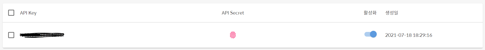
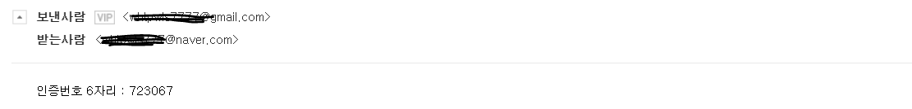

## 핸드폰 인증

#### Coolsms JAVA SDK 이용을 위한 설정

- **Download SDK**

```xml
<dependency>
    <groupId>net.nurigo</groupId>
    <artifactId>javaSDK</artifactId>
    <version>2.2</version>
</dependency>
```


- **COOLSMS 회원가입 후 API KEY 생성**




- 컨트롤러 생성

```java
package kr.ac.arttech.auth.controller;

import java.util.HashMap;

import org.json.simple.JSONObject;
import org.springframework.stereotype.Controller;
import org.springframework.web.bind.annotation.RequestMapping;
import org.springframework.web.bind.annotation.ResponseBody;

import kr.ac.arttech.util.RandomNO;
import net.nurigo.java_sdk.api.Message;
import net.nurigo.java_sdk.exceptions.CoolsmsException;

@Controller
@RequestMapping("/auth")
public class AuthController {
	
	@RequestMapping("/smsAuth.do")
	@ResponseBody
	public String authPhone(String phone) {
		//핸드폰 번호
		String ran = RandomNO.getRanNo(6, 1);
		
		//System.out.println("핸드폰 ran : " + ran);
		
		//여기부터 끝까지 주석
		String api_key = "API KEY입력";
	    String api_secret = "API SECRET 입력";
	    Message coolsms = new Message(api_key, api_secret);

	    // 4 params(to, from, type, text) are mandatory. must be filled
	    HashMap<String, String> params = new HashMap<String, String>();
	    params.put("to", phone); //받는 사람
	    params.put("from", "보내는 사람 번호 입력"); //보내는 사람
	    params.put("type", "SMS");
	    params.put("text", "[세진아트테크] 인증번호 : " + ran);
	    params.put("app_version", "test app 1.2"); // application name and version
	    
	    
	    try {
	      JSONObject obj = (JSONObject) coolsms.send(params);
	      System.out.println(obj.toString());
	      
	    } catch (CoolsmsException e) {
	      System.out.println("에러인가");
	      System.out.println(e.getMessage());
	      System.out.println(e.getCode());
	    }
		return ran;
	}
	
}

```


-----------

#### 이메일 인증

- **JavaMail API 추가**

```xml
<!-- https://mvnrepository.com/artifact/javax.mail/mail -->
<dependency>
    <groupId>javax.mail</groupId>
    <artifactId>mail</artifactId>
    <version>1.4.7</version>
</dependency>
```


- **컨트롤러 생성**

```java
@RequestMapping("/emailAuth.do")
@ResponseBody
public String authEmail(String email) {

    String mail_id = "이메일 id" ;
    String mail_pw = "비밀번호";

    String ran = RandomNO.getRanNo(6, 1);

    //SMTP 서버 정보 설정
    Properties prop = new Properties();
    prop.put("mail.smtp.host", "smtp.gmail.com");
    prop.put("mail.smtp.port", 465); 
    prop.put("mail.smtp.auth", "true"); 
    prop.put("mail.smtp.ssl.enable", "true"); 
    prop.put("mail.smtp.ssl.trust", "smtp.gmail.com");

    Session session = Session.getDefaultInstance(prop, new javax.mail.Authenticator() {
        protected PasswordAuthentication getPasswordAuthentication() {
            return new PasswordAuthentication(mail_id, mail_pw);
        }
    });
    try {
        MimeMessage message = new MimeMessage(session);
        message.setFrom(new InternetAddress(mail_id));

        //수신자 메일 주소
        message.addRecipient(javax.mail.Message.RecipientType.TO, new InternetAddress(email)); 

        // Subject
        message.setSubject("[세진아트테크] 인증번호 발송 안내 메일입니다."); //메일 제목을 입력

        // Text
        message.setText("인증번호 6자리 : " + ran);    //메일 내용을 입력

        // send the message
        Transport.send(message); ////전송

        System.out.println("message sent successfully...");
    } catch (AddressException e) {
        e.printStackTrace();
    } catch (MessagingException e) {
        e.printStackTrace();
    } 

    return ran;
}
```

