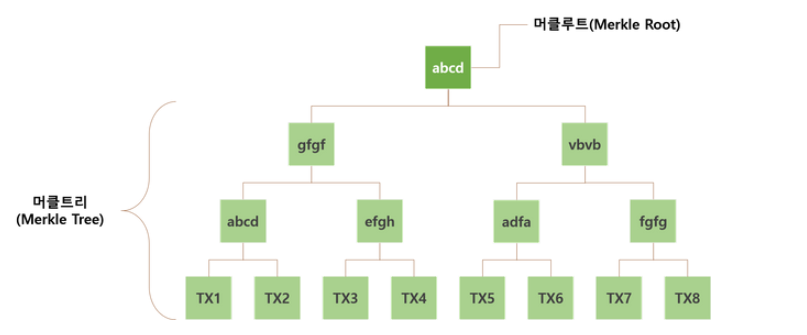

## 작품 등록

- coinbase에서 admin으로 해당 작품의 조각 수만큼 가질 수 있도록 트랜잭션 생성

  - 트랜잭션에 coinbase key값과 admin key값, art id 설정하고 총 조각 수 설정 그리고 inputs에는 null

  - signature를 생성하는데 생성 방법이 보낸사람 address를 base64로 인코딩한 값과 받는 사람의 address를 Base64로 인코딩한 값과 조각 개수를 합쳐주고 privateKey(coinbase의 private key 즉, 보낸 사람의 private key)를 사용하여 ECDSA Signature을 적용해서 생성한다.

    

    ```JAVA
    public static byte[] applyECDSASig(PrivateKey privateKey, String input) {
        Signature dsa;
        byte[] output = new byte[0];
        try {
            dsa = Signature.getInstance("ECDSA", "BC");
            dsa.initSign(privateKey);
          byte[] strByte = input.getBytes();
            dsa.update(strByte);
          byte[] realSig = dsa.sign();
            output = realSig;
      } catch (Exception e) {
            throw new RuntimeException(e);
      }
        return output;
  }
    ```

    
  
    - Base64 : **Binary Data를 Text로 바꾸는** Encoding(binary-to-text encoding schemes)의 하나로써 Binary Data를 Character set에 영향을 받지 않는 공통 ASCII 영역의 문자로만 이루어진 문자열로 바꾸는 Encoding이다.  Base64를 글자 그대로 직역하면 64진법이라는 뜻이다.
    - **ECDSA(Elliptic Curve Digital Signatures Algorithm) : 타원곡선디지털서명알고리즘** 
      - 타원곡선을 이용한 전자서명 알고리즘
      - 비트코인 / 이더리움에서 디지털 서명 알고리즘
      - 네트워크 상에서 거래의 보안을 강화하기 위해 암호 알고리즘을 이용하여 송신자의 신원을 증명하고 수신자가 검증하는 과정이다.
      - 블록체인 상에서 모든 거래 정보가 공유되므로 분산화 되어 있는 디지털 데이터의 진위를 증명하기 위해 전자서명 방식을 사용한다.
      - 쉽게 말해서 여기저기서 오는 거래내용이 진짜인지 가짜인지 판별하기 위해 증명과 검증절차가 필요한 것이다.
  
  - 트랜잭션 ID는 0으로 지정
  
  - 해당 트랜잭션에 output 추가
  
    - output은 받는사람 address(admin address)과 조각 개수, art Id를 사용하여 생성
  
  - UTXOs 추가
  
    - 해당 트랜잭션의 output를 이용
  
    


## 지갑 생성

- 지갑은 KeyPairGenerator 클래스를 사용하여 공개키와 비공개키의 패어를 생성한다.
  - ECDSA 알고리즘을 사용(작품 등록에서 설명)
- 그리고 Base64를 이용하여 String으로 바꿔준 후 사용자에게 전달해서 db에 저장


## 블록 생성

#### 블록 생성을 위한 마이닝 

- 머클루트 구한다.
- block의 hash값이 000 (difficulty의 수)으로 시작할때까지 while문으로 돌리고 시작하면 hash값 생성
- nonce는 0에서부터 시작하고 000(난이도가 3)으로 시작하는 hash값이 나올때까지 ++
- 내 프로젝트는 네트워크가 없으니까 그걸 다른노드에 전파하고 합의과정이 없다. 원래는 다른 노드들이 이 블록이 정상블록인지 아닌지 검증을 하고 51퍼 이상이 정상이라고 하면 그게 이제 정상블록으로 합의되어서 블록체인에 연결되면 채굴한 사람에게 보상이 간다.
  - 비트코인의 블록 생성 주기가 10분이라는 것이 그 많은 채굴자가 넌스값을 찾는 시간임
  - 채굴자가 많아져서 채굴이 빨라지면 난이도가 어렵게 조정됨

```java
public void mineBlock(int difficulty) {
    merkleRoot = StringUtil.getMerkleRoot(transactions);
    String target = StringUtil.getDifficultyString(difficulty); //Create a string with difficulty * "0"
    while(!hash.substring( 0, difficulty).equals(target)) {
    nonce ++;
    hash = calculateHash();
    }
    System.out.println("Block Mined!!! : " + hash);
}
```

- **merkleRoot(머클루트) 구하는 방법**

  - 최초 데이터를 SHA256 형태의 해시값으로 변환한다.
  - 가장 가까운 노드 2개를 한쌍으로 묶어 합친 후 해시값으로 변환한다.
  - 계속해서 해시값으로 변환하여 최종적으로 하나의 결과 값이 나올 때까지 이 과정을 반복한다. 최종적으로 남은 하나의 노드 값이 **'머클루트'** 결과 값이 된다.

  ```java
  public static String getMerkleRoot(ArrayList<Transaction> transactions) {
      int count = transactions.size();
  
      List<String> previousTreeLayer = new ArrayList<String>();
      for(Transaction transaction : transactions) {
          previousTreeLayer.add(transaction.transactionId);
      }
      List<String> treeLayer = previousTreeLayer;
  
      while(count > 1) {
          treeLayer = new ArrayList<String>();
          for(int i=1; i < previousTreeLayer.size(); i+=2) {
              treeLayer.add(applySha256(previousTreeLayer.get(i-1) + previousTreeLayer.get(i)));
          }
          count = treeLayer.size();
          previousTreeLayer = treeLayer;
      }
  
      String merkleRoot = (treeLayer.size() == 1) ? treeLayer.get(0) : "";
      return merkleRoot;
  }
  ```

  


#### 블록 해시

```java
StringUtil.applySha256(
                previousHash +
                        Long.toString(timeStamp) +
                        Integer.toString(nonce) +
                        merkleRoot
        );
```

- 블록의 header 정보를 모두 더해서 합을 구한 후 SHA256으로 변환한 결과값


## 트랜잭션 정보

- 트랜잭션 id (hash)
- art Id
- 보낸사람 address / public key
- 받는사람 address / public key
- 조각 수
- signature
- inputs
- outputs


## 그 외 

> https://steemit.com/kr/@yahweh87/3
>
> https://steemit.com/kr/@yahweh87/4-merkle-tree-merkle-root
>
> https://steemit.com/kr/@yahweh87/5

#### 해시함수

- 해시함수
  - 해시함수는 임이의 길이를 갖는 메시지를 입력받아 고정된 길이의 해시값을 출력하는 함수이다.
  - 해시 함수를 사용하는 목적은 메시지의 오류나 변조를 탐기 위해, 즉 데이터의 무결성을 제공하기 위해 사용한다.
- 해시함수의 특징
  - 어떤 입력 값에도 항상 고정된 길이의 해시 값을 출력 한다.
  - 입력 값의 아주 일부만 변경되어도 전혀 다른 결과 값을 출력한다.(눈사태 효과)
  - 출력된 결과 값을 토대로 입력 값을 유추할 수 없다.


#### 블록체인

- 블록은 비트코인 기준으로 10분에 한 번씩 생성된다.
- 블록체인은 모든 거래 정보를 포함하는 거대한 분산 장부이다.
- 블록체인은 분산되고, 독립적이며, 공통 장부(원장, Ledger) 관리 기술이라고 할 수 있다.


#### 블록

- 블록의 구성요소

  - 블록을 구성하는 요소들은 크게 헤더와 블록바디로 나누어볼 수 있다.
  - bits : 난이도 해시 목표값을 의미하는 지표이다. - target (마이닝 할 때 사용)
  - Nonce : 블록을 만드는 과정에서 해시값을 구할 때 필요한 재료 역할을 수행한다. 

   


#### 머클루트(Merkle Root)



- **머클루트란?**
  - 블록의 바디 부분에 저장된 트랜잭션(거래 정보) 들의 해시 트리라고 생각하면 된다.
  - 각 트랜잭션과 가까운 노드끼리 쌍을 지어 해시 값을 구하여 최종적으로 구해진 해시 값이 머클루트 해시 값이 된다.
- **머클루트의 역할**
  - 머클루트 값을 통해 단일 블록 내에 존재하는 트랜잭션의 무결성을 검증할 수 있다. 
  - 블록의 바디정보에 저장된 트랜잭션의 정보들이 유효한지 빠르게 검사하기 위한 역할
  - 머클루트 값을 이용하여 블록의 해시 값을 생성하였기 때문에 블록의 해시의 무결성도 함께 검증할 수 있다.
  - 즉, 해당 블록이 유효한지에 대한 무결성을 검증하기 위한 요소가 머클루트이다.
- **머클트리의 목적**
  - 빠른 검색이 아니라 데이터의 간편하고 확실한 인증을 위해 사용한다.


